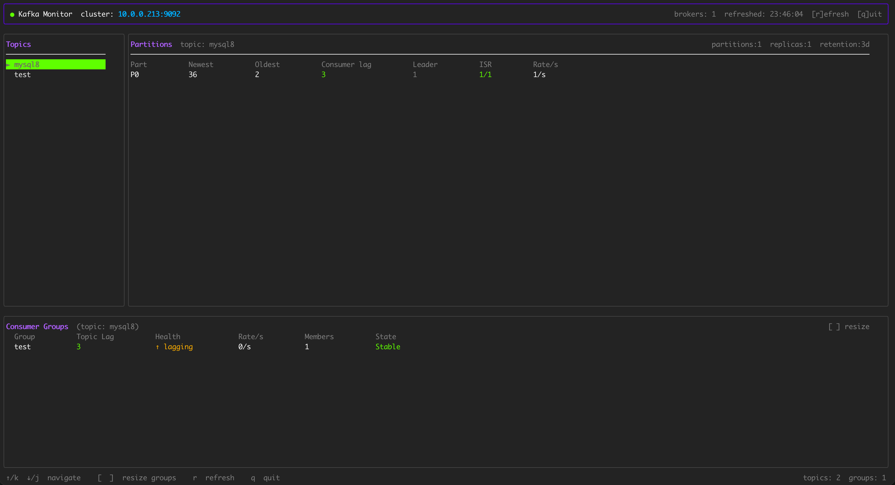

# kafkastat

A terminal UI for monitoring Kafka clusters

## Preview



## Features

- **Topic list** — browse all topics with keyboard navigation
- **Partition detail** — per-partition Newest/Oldest offsets, Consumer lag, Leader broker, ISR ratio, produce Rate/s
- **Topic metadata** — partition count, replication factor, retention period shown in the panel header
- **Consumer groups** — groups filtered by selected topic; columns: Topic Lag, Health, consume Rate/s, Members, State (colour-coded)
- **Dynamic column widths** — sized to content, extra screen space distributed evenly across columns
- **Resizable panels** — adjust the consumer groups panel height with `[` / `]`
- **Auto-refresh** — configurable interval (default 5 s)
 
## Build

```bash
go build -o kafkastat .
```

## Usage

```bash
# Connect to a local broker
./kafkastat

# Specify broker and refresh interval
./kafkastat -broker kafka.example.com:9092 -refresh 10
```

### Flags

| Flag | Default | Description |
|---|---|---|
| `-broker` | `localhost:9092` | Kafka broker address (`host:port`) |
| `-refresh` | `5` | Refresh interval in seconds |

## Keyboard Shortcuts

| Key | Action |
|---|---|
| `↑` / `k` | Select previous topic |
| `↓` / `j` | Select next topic |
| `[` | Shrink consumer groups panel |
| `]` | Expand consumer groups panel |
| `r` | Force refresh |
| `q` | Quit |

## Column Reference

### Partitions

| Column | Description |
|---|---|
| Part | Partition ID |
| Newest | Latest (high-water mark) offset |
| Oldest | Earliest available offset |
| Consumer lag | Total uncommitted messages across all consumer groups |
| Leader | Leader broker ID |
| ISR | In-sync replicas / total replicas (green = full, yellow = majority, red = minority) |
| Rate/s | Produce rate (messages per second) |

### Consumer Groups

| Column | Description |
|---|---|
| Group | Consumer group name |
| Topic Lag | Total lag for the selected topic |
| Health | `✓ healthy` / `↑ lagging` / `✗ critical` |
| Rate/s | Consume rate (committed offset delta per second) |
| Members | Number of active consumers in the group |
| State | Group state: Stable / Empty / Rebalancing / Dead |
